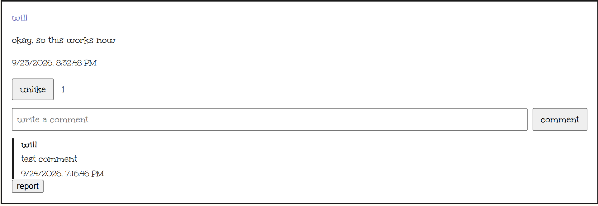

# the daily journal app



## what is it??
this is a small little social media app!

## how can i self host a server?
just sign up to supabase, and replace this
```javascript
const supabaseClient = window.supabase.createClient(
    "YOUR_SUPABASE_PROJECT_URL",
    "YOUR_SUPABASE_PUBLISHABLE_KEY"
);
```
with your keys! <br>
the template's at supabase-config.template.js, and put the new ones at supabase-config.js :)
then, run sql-thing.sql in the supabase sql thing

## how it was built
- html
- css
- js
- _redirects (is that a tech stack thingy?)
- sql (i want to die)